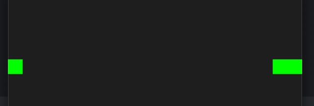

1. Noah Utech:
   
Issue 1
Eine grundlegende Struktur wurde angelegt mit einem Fenster, Game-loop und Bildschrim-Updates

Issue 2
Die Key-Press wurden angelegt, sowie die gegensätzlichen Bewegungen definiert, damit die Schlange sich nur um eine 90 Grade Rotation bewegen kann.

2.
Simon Schmauch:

Um die Bewegungslogik in eine animierte Bewegung umzusetzen, wird immer ein neuer Kopf in die Richtung platziert, wo der Spieler mit den Pfeiltasten hin drückt.

Gleichzeitig wird das letzte Element der Schlange entfernt.

Somit bleibt die Anzahl der Schlangenelemente gleich und kann sich durch den Raum bewegen.

Dies bietet auch eine Grundlange zum Wachsen der Schlange:

Wenn die Schlange in einer Iteration des Spiels ein Apfel isst, wird das letzte Element nicht entfernt, wodurch die Schlange 1 Element mehr bekommt.

3. Joshua Supper:
   
Die Schlange verschwindet nun nicht mehr wenn sie den Bildschirm verlässt sondern kommt auf der
anderen Seite wieder raus.

4.
   Dennis Andler: 

Bisher haben wir nur eine Schlange die sich bewegen lässt. Leider ist diese bisher auf strenger Diät. Um das zu fixen wurde ein Apfel(oder eher ein leckeres rotes Rechteck) eingefuegt.

Dieser Apfel kann von der Schlange gegessen werden indem der Schlangenkopf den Apfel berührt. Wird der Apfel gegessen so wird er an einer zufälligen Stelle des Bildschirms neu generiert. 

Damit der Apfel auch immer schön in der Mitte des Kopfes liegt, wird der Apfel immer in der Mitte möglicher Position des Schlangenviereckes generiert. (nur optisch, eigentlich liegt er genau auf der Ecke vom Schlangendreieck)

